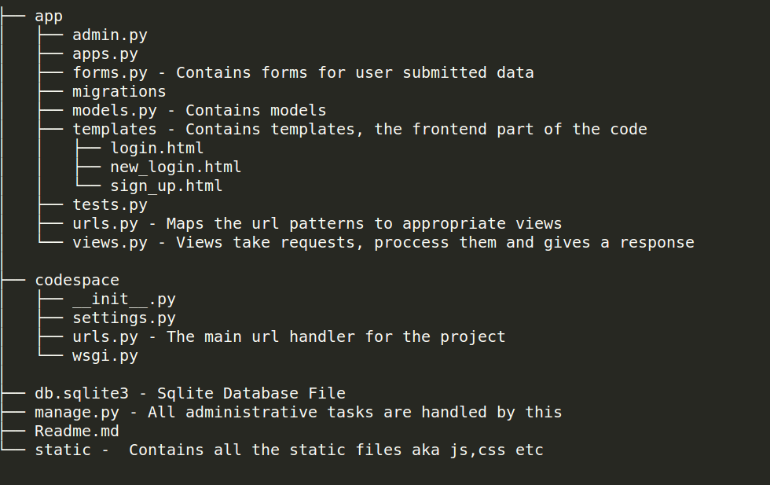

# Codespace Django Starter Kit
This is a django starter-kit for Codespace.


To start the project

```
python manage.py runserver
```

Directory Structure
codespace-django-starterkit




# Django Tutorials

- https://tutorial.djangogirls.org/en/
- https://docs.djangoproject.com/en/1.11/intro/

Palash Golecha 
// github.com/palashgo
// palash.golecha2016@vitstudent.ac.in
