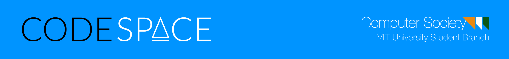

# Codespace Django Starter Kit
This is a django starter-kit for Codespace.


To start the project

```
python manage.py runserver
```

Directory Structure
codespace-django-starterkit

├── app

│   ├── admin.py

│   ├── apps.py

│   ├── forms.py - Contains forms for user submitted data

│   ├── migrations

│   ├── models.py - Contains models 

│   ├── templates - Contains templates, the frontend part of the code

│   │   ├── login.html

│   │   ├── new_login.html

│   │   └── sign_up.html

│   ├── tests.py

│   ├── urls.py - Maps the url patterns to appropriate views

│   └── views.py - Views take requests, proccess them and gives a response

│

├── codespace

│   ├── __init__.py

│   ├── settings.py

│   ├── urls.py - The main url handler for the project

│   └── wsgi.py

│

├── db.sqlite3 - Sqlite Database File

├── manage.py - All administrative tasks are handled by this

├── Readme.md

└── static -  Contains all the static files aka js,css etc


# Django Tutorials

- https://tutorial.djangogirls.org/en/
- https://docs.djangoproject.com/en/1.11/intro/

Palash Golecha 
// github.com/palashgo
// palash.golecha2016@vitstudent.ac.in
